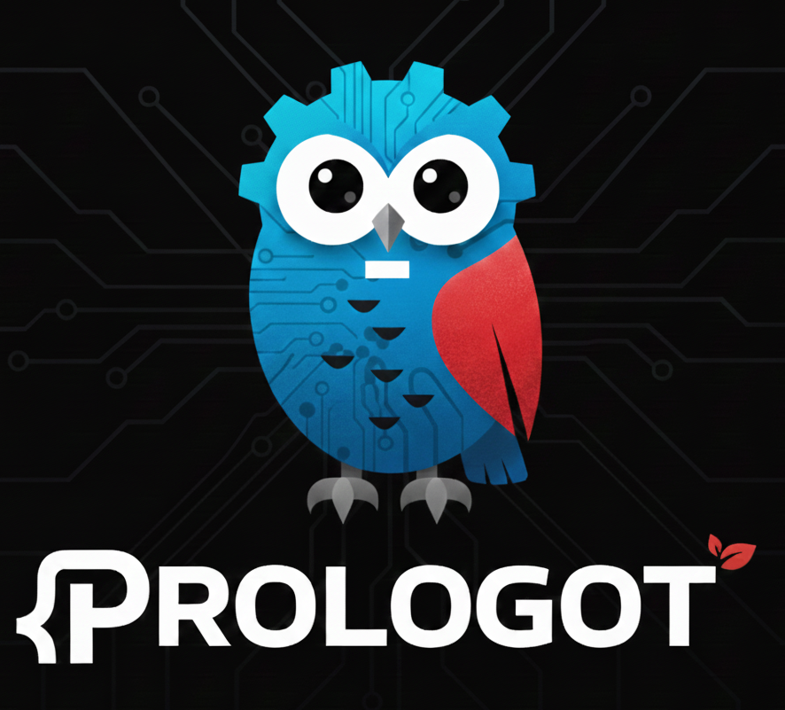

[](https://opensource.org/licenses/MIT) [](https://godotengine.org/) [](https://www.swi-prolog.org/) [](https://github.com/yourusername/Prologot/releases)

# Prologot

<div align="center">
  
</div>

**Prologot** is a GDExtension that integrates SWI-Prolog into Godot 4, enabling logic programming in your games. Use Prolog for AI decision-making, dialogue systems, rule engines, pathfinding, and more.

- SWI-Prolog integration via GDExtension.
- Interactive Prolog console in the Godot editor.
- Query execution with variable bindings.
- Dynamic fact assertion and retraction.
- Consult Prolog files or code strings.
- Knowledge base management.
- Type conversion between Prolog terms and Godot Variants.

You can see **[Use Cases](doc/use-cases.md)** for basic examples and quick start guide.

---

## Documentation

- **Getting Started**: Follow the **[Installation Guide](doc/installation.md)** to set everything up. The quick way to compile:

```bash
# Install dependencies (Linux example)
sudo apt-get install swi-prolog swi-prolog-nox pkg-config
pip install scons

# Clone and build
git clone https://github.com/yourusername/Prologot.git
cd Prologot
make GODOT_CPP=4.5 all
```

- **Try the Demo**: Once built, run the **[Interactive Demo](demos/showcases/README.md)** to see Prologot in action:

```bash
make run-demo
```

- **Try the Game**: Run the **[Galactic Customs Game](demos/galactic_customs/README.md)** to see a basic game using Prolog in action:

```bash
make run-galactic_customs
```

- **Experiment in the Editor**: After playing with the demos, fire up the **[Editor Console](doc/editor-console.md)** in Godot. It's like having a Prolog REPL right in your editor - perfect for tinkering and testing ideas. Once you've convinced yourself that Prolog is actually useful (we know, it's a hard sell), grab the **[hello_world_prologot.gd](hello_world_prologot.gd)** template and start building. Don't forget to check the **[API Reference](doc/API.md)** when you need the details.

- **For Prolog Veterans**: If you're already fluent in Prolog and wondering why we renamed everything, check out the **[Mapping between Prologot and traditional Prolog names](doc/prolog-developers.md)**. We promise it's not just to confuse you.

---

## Project Structure

```sh
Prologot/
├── src/                          # C++ source files
│   ├── Prologot.hpp              # Main class header
│   ├── Prologot.cpp              # Main class implementation
│   ├── register_types.h          # GDExtension registration header
│   └── register_types.cpp        # GDExtension registration
├── tests/                        # Unit tests
├── addons/prologot/              # Godot plugin
│   ├── plugin.cfg                # Plugin configuration
│   ├── plugin.gd                 # Plugin entry point
│   ├── prologot_dock.gd          # Editor dock UI
│   └── prologot_singleton.gd     # Global autoload singleton
├── demos/                        # Demo projects
│   └── showcases/                # Interactive demo project
│       ├── examples/             # Prolog example files (.pl)
│       ├── prologot-demos.gd     # Main demo script (UI and logic)
│       └── prologot-demos.tscn   # Scene file (UI layout)
├── doc/                          # Documentation
│   └── hello_world_prologot.gd   # Hello World example
├── bin/                          # Compiled libraries (after build)
├── prologot.gdextension          # Extension configuration (after build)
├── godot-cpp-*/                  # Godot C++ bindings (git cloned automatically by SConstruct)
├── SConstruct                    # SCons build system (handles everything: setup, compile, generate .gdextension)
└── Makefile                      # Convenience commands to SCons
```

## License

This project is licensed under the MIT License - see the [LICENSE](LICENSE) file for details.

This project used AI to generate code.
