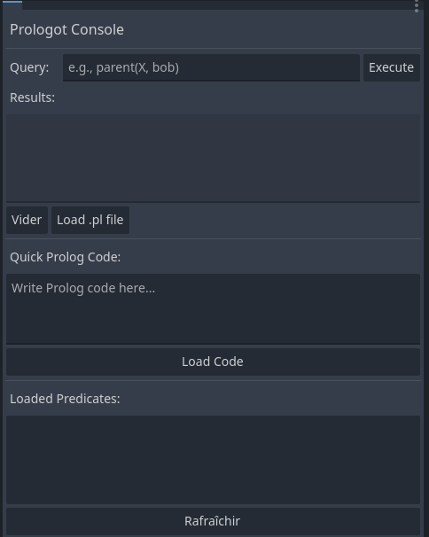

# Prologot

[](https://opensource.org/licenses/MIT)
[](https://godotengine.org/)
[](https://www.swi-prolog.org/)
[](https://github.com/yourusername/Prologot/releases)

**Prologot** is a GDExtension that integrates SWI-Prolog into Godot 4, enabling logic programming in your games. Use Prolog for AI decision-making, dialogue systems, rule engines, pathfinding, and more.

**WARNING: This project is currently in at its beginning age and is currently instable. Do not use it yet! Debugging is currently in progress!**

## Features

- SWI-Prolog integration via GDExtension.
- Interactive Prolog console in the Godot editor.
- Query execution with variable bindings.
- Dynamic fact assertion and retraction.
- Load Prolog files or code strings.
- Knowledge base management.
- Type conversion between Prolog terms and Godot Variants.

## Quick Start

### Prerequisites

- [Godot Engine 4.2+](https://godotengine.org/) - The game engine.
- [SWI-Prolog 8.0+](https://www.swi-prolog.org/) - The Prolog implementation.
- [godot-cpp](https://github.com/godotengine/godot-cpp) - C++ bindings for GDExtension.
- [SCons](https://scons.org/) - is the building system used by Godot and therefore for this project.
- [Python 3](https://www.python.org/) - since Scons is based on Python.
- [C++ compiler](https://gcc.gnu.org/) - for building C++ sources, and optionally a Makefile.
- The build script may ask your sudo password to install operating system packages.

### Installation

#### 1.1 Install SWI-Prolog if needed on your system

**Linux (Debian/Ubuntu):**

```bash
sudo apt-get update
sudo apt-get install swi-prolog swi-prolog-nox
```

**Linux (Arch):**

```bash
sudo pacman -S swi-prolog
```

**macOS:**

```bash
brew install swi-prolog
```

**Windows:**

- Download [SWI-Prolog 8.0+](https://www.swi-prolog.org/download/stable).
- Add to PATH during installation.

#### 1.2 Install SCons if needed

```bash
pip install scons
```

#### 2. Clone the Prologot Repository

```bash
git clone https://github.com/yourusername/Prologot.git
cd Prologot
```

#### 3. Building Sources

The simplest way to build the project is using the **Makefile**. The hierarchy is: **Makefile** → **build.py** → **SCons**.

| Command | Description |
|---------|-------------|
| `make debug` | Compile the extension in debug mode. |
| `make release` | Compile the extension in release mode for performance. |
| `make all` | Build both debug and release versions and set up the demo. |

**Note:** By default, it builds for Godot 4.4. To use another version: `make GODOT_CPP=4.3 debug`.

Other useful commands:

```bash
make help          # Show all available commands
make check-deps    # Verify dependencies
make clean         # Clean build artifacts
make format        # Format C++ sources
make setup-demo    # Set up the demo project (symlinks)
make run-demo      # Run the demo project in Godot
```

#### 4. Running the Demo

An interactive demo is available in `addons/prologot/demos/` that showcases the Prologot API with 6 examples. See [demos/README.md](addons/prologot/demos/README.md) for details.

To use Prologot in your own project:

1. Copy `prologot.gdextension` to your project root
2. Copy the `bin/` folder to your project
3. Copy `addons/prologot/` to your project's `addons/` folder
4. Enable the plugin in **Project → Project Settings → Plugins**

## Project Structure

```sh
Prologot/
├── src/                          # C++ source files
│   ├── Prologot.hpp              # Main class header
│   ├── Prologot.cpp              # Main class implementation
│   ├── register_types.h          # GDExtension registration header
│   └── register_types.cpp        # GDExtension registration
├── tests/                        # Unit tests
├── addons/prologot/              # Godot plugin
│   ├── plugin.cfg                # Plugin configuration
│   ├── plugin.gd                 # Plugin entry point
│   ├── prologot_dock.gd          # Editor dock UI
│   ├── prologot_singleton.gd     # Global autoload singleton
│   └── demos/
│       └── prologot-demos.gd     # Prolog demos
├── bin/                          # Compiled libraries (after build)
├── godot-cpp/                    # Godot C++ bindings (git cloned)
├── prologot.gdextension          # Extension configuration
├── SConstruct                    # Godot build system
├── build.py                      # User build script
└── Makefile                      # Convenience commands to build.py
```

## Usage

### Basic Example

```gdscript
extends Node

var prolog: Prologot

func _ready():
    prolog = Prologot.new()

    if not prolog.initialize():
        push_error("Failed to initialize Prologot")
        return

    # Load facts
    prolog.consult_string("""
        parent(tom, bob).
        parent(bob, ann).
        grandparent(X, Z) :- parent(X, Y), parent(Y, Z).
    """)

    # Execute a query
    if prolog.query("grandparent(tom, ann)"):
        print("Tom is Ann's grandparent!")

    # Get all solutions
    var results = prolog.query_all("parent(X, Y)")
    print("Parent relationships: ", results)

func _exit_tree():
    if prolog:
        prolog.cleanup()
```

### Using the Global Singleton

When the plugin is enabled, you can use the `PrologotEngine` autoload:

```gdscript
extends Node

func _ready():
    # Load rules
    PrologotEngine.load_code("""
        enemy(goblin, 10, low).
        enemy(dragon, 100, high).
        weak_enemy(Name) :- enemy(Name, HP, _), HP < 50.
    """)

    # Query
    if PrologotEngine.query("weak_enemy(goblin)"):
        print("Goblin is a weak enemy")

    # Get results
    var enemies = PrologotEngine.query_all("enemy(Name, HP, Threat)")
    for enemy in enemies:
        print(enemy)
```

### Interactive Demo

An interactive demo application is included in `addons/prologot/demos/` that demonstrates the Prologot API with 6 examples:

- Basic queries
- Facts and rules
- Dynamic assertions
- Complex queries with calculations
- Pathfinding algorithms
- AI behavior patterns

To run the demo:

```bash
make run-demo  # From project root
```


See [addons/prologot/demos/README.md](addons/prologot/demos/README.md) for details.

### Editor Console

The plugin adds a **Prologot Console** dock in the editor where you can:

- Execute Prolog queries interactively
- Load `.pl` files
- Write and load Prolog code snippets
- View loaded predicates



**How to use the dock:**

1. **Enable the plugin**: Go to **Project → Project Settings → Plugins** and enable "Prologot"
2. **Open the dock**: The dock should appear automatically in the bottom-right panel. If not, go to **View → Docks** and look for "Prologot Console"
3. **Initialize Prolog**: The Prolog engine is automatically initialized when the plugin loads. You should see no errors in the output
4. **Load Prolog code**:
   - Use the "Quick Prolog Code" text area to write Prolog code
   - Click "Load Code" to load it into the knowledge base
   - Or use "Load .pl file" to load an existing Prolog file
5. **Execute queries**:
   - Type a Prolog query in the "Query" field (e.g., `parent(X, bob)`)
   - Press Enter or click "Execute"
   - Results appear in the "Results" area
6. **View predicates**: Click "Refresh" to see all loaded predicates in the list

**Example workflow:**

```pl
1. Type in Quick Prolog Code:
   parent(tom, bob).
   parent(bob, ann).
   grandparent(X, Z) :- parent(X, Y), parent(Y, Z).

2. Click "Load Code"

3. Type query: grandparent(X, ann)

4. Click "Execute" or press Enter

5. See results: Solution 1: {result: grandparent(tom, ann), arg1: tom, arg2: ann}
```

## API Reference

### Prologot Class

#### Initialization

| Method | Description |
|--------|-------------|
| `initialize(prolog_home: String = "") -> bool` | Initialize the Prolog engine |
| `cleanup()` | Shut down the Prolog engine |
| `is_initialized() -> bool` | Check if engine is initialized |

#### Loading Code

| Method | Description |
|--------|-------------|
| `consult(filename: String) -> bool` | Load a Prolog file |
| `consult_string(code: String) -> bool` | Load Prolog code from a string |

**Note:** The `consult()` method automatically converts `res://` and `user://` paths to absolute filesystem paths, so you can use Godot virtual filesystem paths directly.

#### Queries

| Method | Description |
|--------|-------------|
| `query(goal: String) -> bool` | Execute a query, return true if it succeeds |
| `query_all(goal: String) -> Array` | Get all solutions as Array of Variants |
| `query_one(goal: String) -> Variant` | Get the first solution (null if none) |
| `get_last_error() -> String` | Get the last Prolog error message |

#### Dynamic Facts

| Method | Description |
|--------|-------------|
| `assert_fact(fact: String) -> bool` | Add a fact to the knowledge base |
| `retract_fact(fact: String) -> bool` | Remove a fact from the knowledge base |
| `retract_all(functor: String) -> bool` | Remove all matching facts |

#### Predicates

| Method | Description |
|--------|-------------|
| `call_predicate(name: String, args: Array) -> bool` | Call a predicate with arguments |
| `call_function(name: String, args: Array) -> Variant` | Call a predicate and get the result |
| `predicate_exists(name: String, arity: int) -> bool` | Check if a predicate exists |
| `list_predicates() -> Array` | List all defined predicates |

### PrologotEngine Singleton (Autoload)

The singleton provides a simplified API for use in game scripts:

| Method | Description |
|--------|-------------|
| `query(goal)` | Execute a query, returns bool |
| `query_all(goal)` | Get all solutions as Array |
| `query_one(goal)` | Get first solution as Variant (null if none) |
| `load_file(path)` | Load a Prolog file |
| `load_code(code)` | Load Prolog code from string |
| `add_fact(fact)` | Assert a fact |
| `remove_fact(fact)` | Retract a fact |
| `call_predicate(name, args)` | Call a predicate with arguments |
| `call_with_result(name, args)` | Call a predicate and get result |
| `create_knowledge_base(name, code)` | Create a named knowledge base |
| `switch_knowledge_base(name)` | Switch to a knowledge base |

**Note:** The singleton is available at runtime (when running the game). For editor plugins, use the Prologot class directly.

## Use Cases

### AI Decision Making

```gdscript
PrologotEngine.load_code("""
    should_attack(Distance, Health) :- Distance < 5, Health > 30.
    should_flee(Health) :- Health < 20.

    decide(attack, Dist, Health) :- should_attack(Dist, Health), !.
    decide(flee, _, Health) :- should_flee(Health), !.
    decide(patrol, _, _).
""")

player_distance = 20
enemy_health = 10
var action = PrologotEngine.call_with_result("decide", [player_distance, enemy_health])
# flee !
```

### Dialogue Systems

```gdscript
PrologotEngine.load_code("""
    dialogue(guard, greeting, "Halt! Who goes there?").
    dialogue(guard, friendly, "Welcome, friend.") :- reputation(player, good).
    dialogue(guard, hostile, "You're not welcome here.") :- reputation(player, bad).
""")

var line = PrologotEngine.call_with_result("dialogue", ["guard", "greeting"])
# Halt! Who goes there?
```

### Rule-Based Systems

```gdscript
PrologotEngine.load_code("""
    can_craft(iron_sword) :- has_item(iron, 3), has_item(wood, 1).
    can_craft(health_potion) :- has_item(herb, 2), has_item(water, 1).
""")

# Add items to inventory
PrologotEngine.add_fact("has_item(iron, 5)")
PrologotEngine.add_fact("has_item(wood, 2)")
PrologotEngine.add_fact("has_item(herb, 3)")

# Check if we can craft items
if PrologotEngine.query("can_craft(iron_sword)"):
    craft_item("iron_sword")
    # Remove used items
    PrologotEngine.remove_fact("has_item(iron, 5)")
    PrologotEngine.add_fact("has_item(iron, 2)")  # 5 - 3 = 2
    PrologotEngine.remove_fact("has_item(wood, 2)")
    PrologotEngine.add_fact("has_item(wood, 1)")  # 2 - 1 = 1
```

## Troubleshooting

### "swipl not found"

```bash
# Check installation
which swipl
swipl --version

# Add to PATH if needed (Linux/macOS)
export PATH=$PATH:/usr/lib/swi-prolog/bin
```

## License

This project is licensed under the MIT License - see the [LICENSE](LICENSE) file for details.

This project used AI to generate code.
