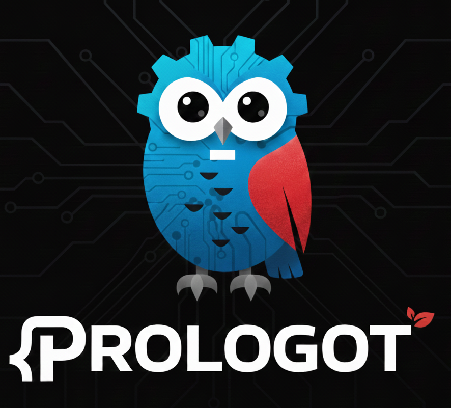

[](https://opensource.org/licenses/MIT) [](https://godotengine.org/) [](https://www.swi-prolog.org/) [](https://github.com/yourusername/Prologot/releases)

# Prologot

<div align="center">
  
</div>

**Prologot** is a GDExtension that integrates SWI-Prolog into Godot 4, enabling logic programming in your games. Use Prolog for AI decision-making, dialogue systems, rule engines, pathfinding, and more.

- SWI-Prolog integration via GDExtension.
- Interactive Prolog console in the Godot editor.
- Query execution with variable bindings.
- Dynamic fact assertion and retraction.
- Consult Prolog files or code strings.
- Knowledge base management.
- Type conversion between Prolog terms and Godot Variants.

Documentation path: **[Getting started](doc/getting-started.md)** → **[Use cases](doc/use-cases.md)** → **[API reference](doc/API.md)**. Prolog veterans: **[Prolog developers](doc/prolog-developers.md)**. Playable object-API demo: **[Mini Dungeon](demos/mini_dungeon/README.md)** (`make run-mini-dungeon`).

---

## Documentation

- **Getting Started**: Follow the **[Installation Guide](doc/installation.md)** to set everything up. The quick way to compile:

### Fedora

```bash
sudo dnf install gcc-c++ make python3-scons pkgconf pl pl-devel libstdc++-static
pip install scons
```

### Debian / Ubuntu

```bash
sudo apt-get install g++ make pkg-config swi-prolog swi-prolog-nox
pip install scons
```

### Prologot compilation

```bash
git clone https://github.com/Lecrapouille/Prologot.git
cd Prologot
make GODOT_CPP=4.5 all
```

You do not need to pass `-j8` options, the number of cores is found automatically.

- **Mini Dungeon**: A short dungeon crawler whose monster AI is Prolog — **[demos/mini_dungeon](demos/mini_dungeon/README.md)**:

```bash
make run-mini-dungeon
```

- **Try the Demo**: Once built, run the **[Interactive Demo](demos/showcases/README.md)** to see Prologot in action:

```bash
make run-demo
```

- **Try the Game**: Run the **[Galactic Customs Game](demos/galactic_customs/README.md)** to see a basic game using Prolog in action:

```bash
make run-galactic_customs
```

- **Getting started from GDScript**: **[Getting started](doc/getting-started.md)** (concepts → first program → pitfalls). Run **[Mini Dungeon](demos/mini_dungeon/README.md)**, then **[Use cases](doc/use-cases.md)** and **[API reference](doc/API.md)**. Minimal script-only sample: [hello_world_prologot.gd](doc/hello_world_prologot.gd).

- **For Prolog veterans**: **[Note for Prolog developers](doc/prolog-developers.md)** — SWI ↔ Prologot mapping and traps.

---

## Project Structure

```sh
Prologot/
├── src/                          # C++ source files
│   ├── Prologot.hpp              # Main class header
│   ├── Prologot.cpp              # Main class implementation
│   ├── register_types.h          # GDExtension registration header
│   └── register_types.cpp        # GDExtension registration
├── tests/                        # Unit tests
├── addons/prologot/              # Godot plugin
│   ├── plugin.cfg                # Plugin configuration
│   ├── plugin.gd                 # Plugin entry point
│   ├── prologot_dock.gd          # Editor dock UI
│   ├── prologot_singleton.gd     # Global autoload singleton
│   ├── prologot_node.gd          # Scene-tree Node (PrologotNode)
│   └── prolog_knowledge.gd       # Inspectable Resource (PrologKnowledge)
├── demos/                        # Demo projects
│   ├── mini_dungeon/             # Playable dungeon (object API + Prolog AI)
│   └── showcases/                # Interactive demo project
│       ├── examples/             # Prolog example files (.pl)
│       ├── prologot-demos.gd     # Main demo script (UI and logic)
│       └── prologot-demos.tscn   # Scene file (UI layout)
├── doc/                          # Documentation
│   └── hello_world_prologot.gd   # Hello World example
├── bin/                          # Build output (after build)
│   ├── linux/                    # Linux libs + swipl/
│   ├── windows/                  # Windows libs + swipl/
│   ├── macos/                    # macOS libs + swipl/
│   └── prologot.gdextension     # GDExtension configuration
├── godot-cpp-*/                  # Godot C++ bindings (git cloned automatically by SConstruct)
├── SConstruct                    # SCons build system (handles everything: setup, compile, generate .gdextension)
└── Makefile                      # Convenience commands to SCons
```

## License

This project is licensed under the MIT License - see the [LICENSE](LICENSE) file for details.

This project used AI to generate code.
