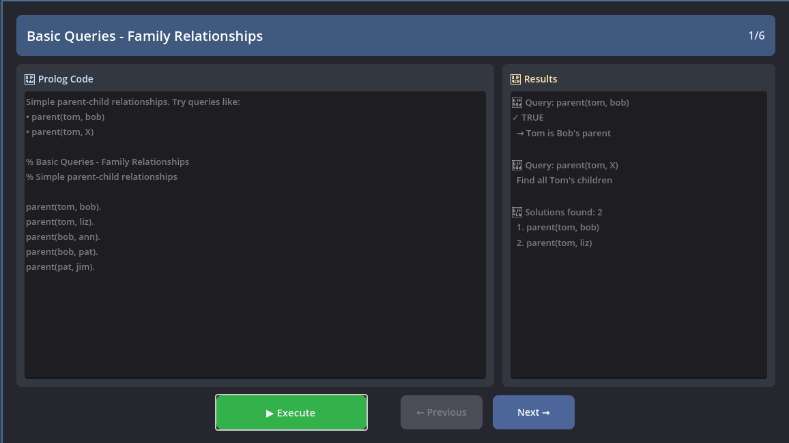

# Prologot Interactive Demo

A demo application that demonstrates the Prologot API with interactive examples.



## Features

- Navigation between examples with Previous/Next buttons
- Execute Prolog code on demand and view results
- 6 examples covering basic queries to pathfinding and AI behavior
- Each example uses a separate `.pl` file

## Architecture

The demo is structured as follows:

- **Scene file** (`node_2d.tscn`): UI layout defined in Godot's editor
- **Script** (`prologot-demos.gd`): Main logic that calls Prologot API methods
- **Prolog files** (`examples/*.pl`): Prolog code for each example
- **Configuration** (`examples.json`): Metadata describing each example

## Setup

Before running the demo, check if the Godot extension file and libprologot exists:

```bash
cd addons/prologot/demos
ln -s ../../../bin bin
ln -s ../../../prologot.gdextension prologot.gdextension
```

Or from the project root:

```bash
make setup-demo
```

## Running

Open this folder as a Godot project:

```bash
make run-demo
```

Or headless mode:

```bash
godot --headless --path addons/prologot/demos
```

## Examples

### 1. Basic Queries

**File**: `examples/01_basic_queries.pl`

Simple parent-child relationships demonstrating:

- `prolog.query()` - Simple yes/no queries
- `prolog.query_all()` - Get all solutions

### 2. Facts and Rules

**File**: `examples/02_facts_and_rules.pl`

Grandparent and ancestor relationships showing:

- Rule definitions with `:-`
- Recursive rules
- Multiple query patterns

### 3. Dynamic Assertions

**File**: `examples/03_dynamic_assertions.pl`

Runtime fact management with:

- `prolog.assert_fact()` - Add facts dynamically
- `prolog.retract_fact()` - Remove specific facts
- `prolog.retract_all()` - Remove all matching facts

### 4. Complex Queries

**File**: `examples/04_complex_queries.pl`

Combat system with calculations:

- `prolog.call_predicate()` - Call predicates with arguments
- `prolog.call_function()` - Get calculated values
- Arithmetic in Prolog with `is`

### 5. Pathfinding

**File**: `examples/05_pathfinding.pl`

Graph traversal demonstrating:

- Cycle detection with `\+ member()`
- Recursive path finding
- Multiple solution exploration

### 6. AI Behavior

**File**: `examples/06_ai_behavior.pl`

Decision-making system showing:

- Conditional rules
- Cut operator `!` for deterministic choices
- Game AI patterns

## Key Prologot API Calls

The demo showcases these essential API methods:

```gdscript
# Initialization
prolog = Prologot.new()
prolog.initialize()

# Loading Prolog code
prolog.consult("path/to/file.pl")         # Load from file
prolog.consult_string("fact(data).")      # Load from string

# Queries
prolog.query("parent(tom, bob)")          # Returns bool
prolog.query_one("parent(tom, X)")        # Returns first solution
prolog.query_all("parent(tom, X)")        # Returns all solutions

# Dynamic facts
prolog.assert_fact("new_fact(value)")     # Add fact
prolog.retract_fact("old_fact(value)")    # Remove fact
prolog.retract_all("pattern(_)")          # Remove all matching

# Function calls
prolog.call_predicate("name", ["arg1"])   # Call with args, returns bool
prolog.call_function("name", ["arg1"])    # Call and get result

# Cleanup
prolog.cleanup()
```

## Adding New Examples

- Create a new `.pl` file in `examples/`
- Add entry to `examples/examples.json`:

```json
   {
     "title": "Your Example",
     "file": "res://examples/your_example.pl",
     "description": "What it demonstrates..."
   }
```

- Add execution function in `prologot-demos.gd`

## File Structure

```
demos/
├── node_2d.tscn              # Godot scene with UI widgets
├── prologot-demos.gd                # Script with Prologot API calls
├── examples/
│   ├── examples.json         # Example metadata
│   ├── 01_basic_queries.pl
│   ├── 02_facts_and_rules.pl
│   ├── 03_dynamic_assertions.pl
│   ├── 04_complex_queries.pl
│   ├── 05_pathfinding.pl
│   └── 06_ai_behavior.pl
└── README.md
```

## Learning Path

The examples are ordered from simple to complex:

1. Basic Queries - Query execution and results
2. Facts and Rules - Prolog syntax and rule definitions
3. Dynamic Assertions - Runtime fact management
4. Complex Queries - Predicate calls and calculations
5. Pathfinding - Recursive algorithms
6. AI Behavior - Decision-making patterns

Each example can be run independently.
