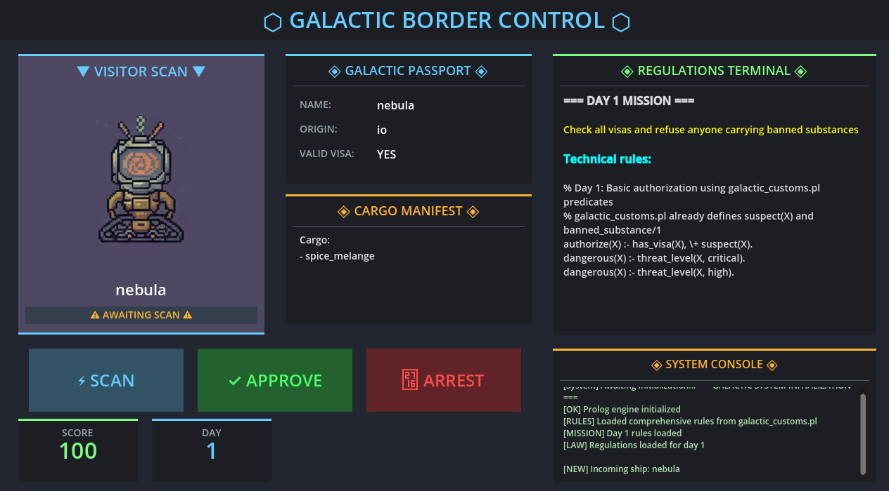

# 🚀 Galactic Customs: Sector 9 Border Control

A simulation/management game where you play as a space immigration officer using **Prolog for game logic**.



## 📋 Description

You manage a space border control station. Aliens arrive with passports, visas, and cargo. You must decide who enters, who is taxed, and who is arrested according to galactic laws that change each day.

## 🎮 Features Used

This game demonstrates key features of the Prologot API:

### Initialization & Management
1. ✅ `initialize()` - Initializes the engine on startup
2. ✅ `cleanup()` - Cleans up resources on shutdown
3. ✅ `is_initialized()` - Checks engine state

### Code Loading
4. ✅ `consult_file()` - Loads permanent rules from `galactic_customs.pl`
5. ✅ `consult_string()` - Loads daily laws dynamically

### Queries
6. ✅ `query()` - Checks if an alien is dangerous
7. ✅ `query_all()` - Lists all cargo items of an alien

### Dynamic Facts
8. ✅ `add_fact()` - Adds scanned alien characteristics
9. ✅ `retract_all()` - Cleans all facts between each alien

### Predicates
10. ✅ `call_predicate()` - Verifies if authorization is legal
11. ✅ `call_function()` - Calculates tax amounts

### Introspection
12. ✅ `predicate_exists()` - Checks if a predicate exists before calling

## 🛠️ Installation

### Prerequisites
- Godot 4.0+
- Prologot extension installed and functional

### Project Structure

```
res://
├── scripts/
│   ├── main.gd              # Main game script
│   └── alien_sprite.gd      # Alien sprite display script
├── scenes/
│   ├── main.tscn            # Main scene
│   └── alien.tscn           # Alien sprite scene
├── rules/
│   └── galactic_customs.pl  # Comprehensive Prolog knowledge base
├── assets/
│   ├── assets-1.png         # Alien sprite sheet
│   └── assets-2.png         # UI assets
└── project.godot            # Godot project configuration
```

### Setup Steps

1. **Create a new Godot 4 project**
2. **Install Prologot** in your project
3. **Copy the demo files** to your project:
   - All files from `demos/galactic_customs/`
4. **Configure the main scene**:
   - Open `scenes/main.tscn` in the editor
   - Verify all nodes are properly set up
5. **Run the game**: Press F5

## 🎯 Gameplay

### Controls
- **SCAN** : Analyzes the alien and loads their information into Prolog
- **APPROVE** : Allows the alien to pass (verified by Prolog)
- **ARREST** : Detains the alien (if dangerous or illegal)

### Scoring
- ✅ Correct approval: **+10 points**
- ✅ Justified arrest: **+15 points**
- ❌ Wrong approval: **-20 points**
- ❌ Unjustified arrest: **-25 points**
- 🎯 Game Over at **0 points**
- 🏆 Victory after completing **Day 3** (after processing 5 aliens / day)

### Day Progression
- **Day 1** : Basic authorization
  - Check visas and refuse banned substances
  - Dangerous = critical or high threat level

- **Day 2** : Stricter rules
  - All tentacled aliens are dangerous
  - Mars origin is prohibited

- **Day 3** : Comprehensive security
  - Europa quarantine in effect
  - Strict criminal background checks
  - Multiple threat level checks

### Day Advancement
- After processing **5 aliens**, the game automatically advances to the next day
- After completing Day 3, a victory message is displayed
- The game pauses on game over (score ≤ 0) or victory

## 🔬 Technical Architecture

### Game Flow

```
1. load_next_alien()
   └─> retract_all() - Cleans old facts

2. scan_alien()
   ├─> add_fact() - Adds visa, tentacles, cargo, etc.
   ├─> query() - Checks danger level
   ├─> call_function() - Calculates tax
   └─> query_all() - Lists all cargo

3. make_decision(approve/arrest)
   └─> call_predicate("authorize", [name]) - Legal decision?
```

### Knowledge Base

The game uses a two-tier rule system:

1. **galactic_customs.pl** (permanent rules)
   - Base knowledge: species, planets, substances
   - Complex predicates: `suspect/1`, `threat_level/2`, `requires_quarantine/1`
   - Tax calculation: `calculate_total_tax/2`

2. **Daily mission rules** (dynamic rules)
   - Loaded via `consult_string()` each day
   - Override or extend base rules
   - Define day-specific `authorize/1` and `dangerous/1` predicates

### Visual Feedback

- **Green flash**: Success message on correct approval
- **Red flash**: Error message on mistakes
- **Red overlay**: Permanent game over message (score ≤ 0)
- **Green overlay**: Permanent victory message (all days completed)

## 🧪 Testing

To test each feature:

1. **Scan** an alien → Tests `add_fact()`, `query()`, `query_all()`
2. **Approve/Arrest** → Tests `call_predicate()`
3. **Observe console** → Shows all Prolog operations
4. **Process 5 aliens** → Tests day advancement and `consult_string()`

## 📚 Prolog Rules Examples

The game uses complex Prolog rules from `galactic_customs.pl`:

```prolog
% Check if alien is suspect
suspect(X) :- has_cargo(X, C), banned_substance(C).
suspect(X) :- origin(X, P), planet(P, outer), \+ has_visa(X).

% Calculate threat level
threat_level(X, critical) :- has_tentacles(X), has_cargo(X, C), banned_substance(C).

% Tax calculation
calculate_total_tax(X, Total) :-
    findall(T, (has_cargo(X, C), taxable_substance(C, T)), Taxes),
    sum_list(Taxes, Total).
```