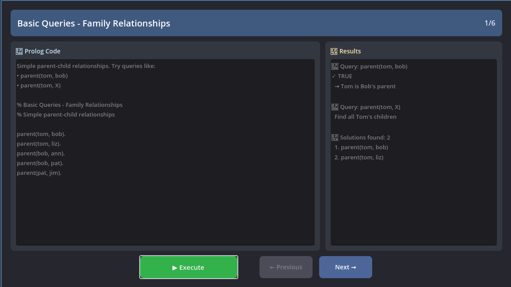

# Interactive Demo

An interactive application, included in [demos/showcases](../demos/showcases), that demonstrates the Prologot API with six examples:

| ID | Name         | Description                                                                               |
|-----------------|----------------------|-------------------------------------------------------------------------------------------|
| 1               | Basic Queries        | Queries on simple facts to demonstrate the basics of Prolog.                              |
| 2               | Facts and Rules      | Loading Prolog files and querying rules with multiple solutions.                           |
| 3               | Dynamic Assertions   | Dynamically adding and removing facts during gameplay.                                    |
| 4               | Complex Queries      | Using Prolog for complex calculations and advanced logic.                                 |
| 5               | Pathfinding          | Implementation of pathfinding algorithms using Prolog.                                    |
| 6               | AI Behavior          | Creating decision-making systems for game AI.                                             |

## Running the Demo

To run the demo, either launch it from Godot editor or type the following command from the Prologot root project:

```bash
make run-demo
```

You will see this windows (may differ):



Press the "Execute" button to see the result displayed on the right side of the windows. Press the "next" button to see the next example.

## Project Structure

- **`prologot-demos.gd`** - Main GDScript file that implements the demo UI and logic. This script:
  - Manages the showcase navigation (Previous/Next buttons)
  - Loads Prolog files from the `examples/` subdirectory
  - Executes queries and displays results
  - Handles user interactions with the demo interface

- **`examples/`** - Directory containing Prolog showcase files:
  - `01_basic_queries.pl` - Basic fact queries and variable bindings
  - `02_facts_and_rules.pl` - Loading and querying Prolog rules
  - `03_dynamic_assertions.pl` - Adding and removing facts at runtime
  - `04_complex_queries.pl` - Using Prolog for computations
  - `05_pathfinding.pl` - Implementing pathfinding with Prolog
  - `06_ai_behavior.pl` - Decision-making systems for game AI
  - `examples.json` - Metadata describing each showcase

Each `.pl` file contains standalone Prolog code that can be loaded and executed independently.

## Adding New Examples

- Create a new `.pl` file in `examples/`
- Add entry to `examples/examples.json`:

```json
   {
     "title": "Your Example",
     "file": "res://examples/your_example.pl",
     "description": "What it demonstrates..."
   }
```

- Add execution function in `prologot-demos.gd`

## Current Examples

### 1. Basic Queries

**File**: `examples/01_basic_queries.pl`

Simple parent-child relationships demonstrating:

- `prolog.query()` - Simple yes/no queries
- `prolog.query_all()` - Get all solutions

### 2. Facts and Rules

**File**: `examples/02_facts_and_rules.pl`

Grandparent and ancestor relationships showing:

- Rule definitions with `:-`
- Recursive rules
- Multiple query patterns

### 3. Dynamic Assertions

**File**: `examples/03_dynamic_assertions.pl`

Runtime fact management with:

- `prolog.add_fact()` - Add facts dynamically
- `prolog.retract_fact()` - Remove specific facts
- `prolog.retract_all()` - Remove all matching facts

### 4. Complex Queries

**File**: `examples/04_complex_queries.pl`

Combat system with calculations:

- `prolog.call_predicate()` - Call predicates with arguments
- `prolog.call_function()` - Get calculated values
- Arithmetic in Prolog with `is`

### 5. Pathfinding

**File**: `examples/05_pathfinding.pl`

Graph traversal demonstrating:

- Cycle detection with `\+ member()`
- Recursive path finding
- Multiple solution exploration

### 6. AI Behavior

**File**: `examples/06_ai_behavior.pl`

Decision-making system showing:

- Conditional rules
- Cut operator `!` for deterministic choices
- Game AI patterns