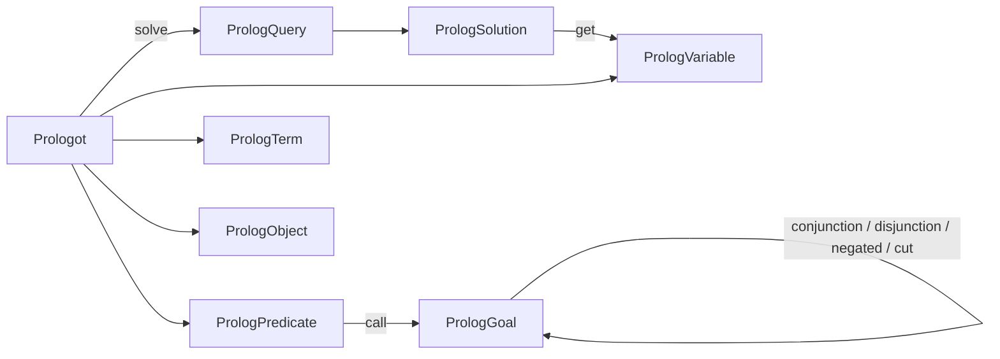

# Prologot API reference

Complete reference for the Prologot GDExtension. For concepts and tutorials, start with [Getting started](getting-started.md); for game recipes, see [Use cases](use-cases.md).

---

## Table of contents

1. [Overview](#overview)
2. [Class `Prologot`](#class-prologot)
   - [Initialization](#initialization-and-cleanup)
   - [Loading knowledge](#loading-knowledge)
   - [Term factories](#term-factories)
   - [Query execution](#query-execution)
   - [Dynamic facts](#dynamic-facts)
   - [Exposing Godot members](#exposing-godot-members)
   - [Introspection](#introspection)
3. [Class `PrologPredicate`](#class-prologpredicate)
4. [Class `PrologGoal`](#class-prologgoal)
5. [Class `PrologQuery`](#class-prologquery)
6. [Class `PrologSolution`](#class-prologsolution)
7. [Class `PrologVariable`](#class-prologvariable)
8. [Class `PrologTerm`](#class-prologterm)
9. [Class `PrologObject`](#class-prologobject)
10. [Scene integration](#scene-integration)
11. [PrologotEngine singleton](#prologotengine-singleton-autoload)
12. [Type conversion](#type-conversion)

---

## Overview

### Minimal lifecycle

```gdscript
const PrologotBoot = preload("res://addons/prologot/prologot_boot.gd")

var prolog = PrologotBoot.create_engine()

# prolog.consult_file("res://rules.pl")
prolog.consult_string("""
parent(tom, bob).
parent(tom, liz).
""")

var parent = prolog.predicate("parent")
var child = prolog.variable("Child")
prolog.solve(parent.call("tom", "bob")).has_solution()
for solution in prolog.solve(parent.call("tom", child)):
    print(solution.get(child))

prolog.cleanup()
```

`PrologotBoot.create_engine()` wraps `Prologot.new()` + `initialize()` and picks the bundled `res://bin/<os>/swipl` home when present. You can also call `initialize()` directly on a `Prologot` instance.

**Threading:** not thread-safe. Call `initialize()`, `solve()`, `consult_*`, and `cleanup()` only on Godot's **main thread**. Calls from `WorkerThreadPool` or other threads log an error and fail. SWI-Prolog is a single process-global engine; each `Prologot` is a handle, not an isolated engine.

### Object graph



### Rules of thumb

| Topic | Rule |
|-------|------|
| Goals | `predicate(name).call(...)` — not string queries |
| Success test | `solve(goal).has_solution()` — not `if solve(goal):` |
| Reading answers | `first()` / `for` / `all()` + `sol.get(var)` — no `query.values()` |
| Huge / infinite domains | `first()`, `break`, or `solve(goal, n)` — not unbounded `all()` |
| Variables | `variable()` / `anonymous()` — not `"X"` strings |
| Bindings | `solution.get(var_object)` — not `solution["X"]` |
| Arity | From `call()` argument count, not `predicate(name, n)` |
| Composition | `conjunction` / `disjunction` / `negated` / `cut` |

---

## Class `Prologot`

Main entry point. SWI-Prolog is process-global; each `Prologot` instance is a handle on that engine.

### Initialization and cleanup

#### `initialize(options: Dictionary = {}) -> bool`

On the first call in the process, starts SWI-Prolog and bootstraps helpers for `consult_string()`. Then attaches this handle. Safe to call again on the same handle while already initialized (no-op attach).

**Returns:** `true` on success. On failure, call `get_last_error()`.

**Common options:**

| Option | Type | Default | Description |
|--------|------|---------|-------------|
| `"home"` | String | `""` | SWI-Prolog home (`res://bin/.../swipl`). When omitted, Prologot tries the bundled `res://bin/<os>/swipl` path, then the system install |
| `"quiet"` | bool | `true` | Suppress startup messages |
| `"stack limit"` | String | `""` | e.g. `"1g"`, `"512m"` |
| `"table space"` | String | `""` | SLG table space |
| `"optimized"` | bool | `false` | Optimized compilation |
| `"threads"` | bool | `true` | Allow threads |
| `"on error"` | String | `"print"` | `"print"`, `"halt"`, `"status"` |
| `"on warning"` | String | `"print"` | Same values |
| `"init file"` | String | — | `swipl -f`: user init instead of `~/.swiplrc` |
| `"script file"` | String | — | `swipl -l`: consult a `.pl` at boot (`consult_file` after start) |
| `"toplevel"` | String | — | `swipl -t`: REPL goal; unused in Godot |
| `"goal"` | String / Array | — | `swipl -g`: goal(s) run at startup |
| `"prolog flags"` | Dictionary | `{}` | Flag overrides |
| `"file search paths"` | Dictionary | `{}` | File search paths |

```gdscript
prolog.initialize({"home": "res://bin/linux/swipl", "on error": "print"})
```

#### `cleanup() -> void`

Detaches this handle. Safe to call multiple times. Does **not** call `PL_cleanup()`
(that runs when the GDExtension unloads). When the last handle detaches, the user
knowledge base is reset. Call `initialize()` again before further use.

#### `clear_knowledge() -> bool`

Removes user predicates added through `consult_*` and `assert_fact`. The handle
stays attached and SWI keeps running. Main thread only, like `initialize()`.

#### `is_initialized() -> bool`

#### `get_last_error() -> String`

Last stored error string. Does not call `push_error()`.

---

### Loading knowledge

#### `consult_file(filename: String) -> bool`

Loads a `.pl` file through SWI `consult/1`. Supports Godot `res://` and `user://`.

**Note:** clauses **accumulate** across repeated calls.

#### `consult_string(code: String) -> bool`

Parses multi-line Prolog (facts, rules, directives) via bootstrap predicate.

---

### Term factories

Optional helpers for building terms explicitly. Most queries pass plain Variants to `call()` directly.

| Method | Returns | Notes |
|--------|---------|-------|
| `atom(name: String)` | `PrologTerm` | Atom |
| `integer(value: int)` | `PrologTerm` | Integer |
| `real(value: float)` | `PrologTerm` | Float |
| `string(value: String)` | `PrologTerm` | Prolog string `"…"`, not atom |
| `nil()` | `PrologTerm` | `[]` |
| `list(items: Array)` | `PrologTerm` | Prolog list |
| `compound(functor: String, args: Array)` | `PrologTerm` | Compound |
| `variable(name: String = "")` | `PrologVariable` | Logical variable |
| `anonymous()` | `PrologVariable` | `_` |
| `predicate(name: String)` | `PrologPredicate` | Reusable functor |
| `object(value: Object)` | `PrologObject` | Node / Resource handle |

**`call()` accepts:** atoms (String), numbers, arrays (lists), `PrologVariable`, `PrologObject`, Nodes/Resources (auto-wrapped).

---

### Query execution

#### `solve(goal: PrologGoal, max_solutions: int = 0) -> PrologQuery`

Opens a lazy SWI query (`PL_open_query`) and returns a `PrologQuery`. Answers are **not** fetched upfront: each later call pulls at most one solution via `PL_next_solution`. A `max_solutions` of `0` means no limit.

Knowledge used in the examples:

```text
parent(tom, bob). parent(tom, liz). parent(bob, ann).
```

```gdscript
var parent = prolog.predicate("parent")
var child = prolog.variable("Child")
var via = prolog.variable("Via")
```

**`has_solution()` — yes / no (at most one pull, then cut)**

```gdscript
if prolog.solve(parent.call("tom", "bob")).has_solution():
    print("true")
```

Even a ground goal that succeeds returns one (possibly empty) `PrologSolution`. Remaining choice points are cut so `solve(g).has_solution()` does not leave Prolog open. After that, `all()` or `for` on the **same** query object only see the cached first answer.

**`first()` — one `PrologSolution` or `null` (at most one pull, then cut)**

```gdscript
var sol = prolog.solve(parent.call("tom", child)).first()
if sol != null:
    print(sol.get(child))   # bob
```

Fetches a single solution. Use `for` or `all()` when you need every answer.

**`for` — one solution per iteration; `break` commits**

```gdscript
for sol in prolog.solve(parent.call("tom", child)):
    print(sol.get(child))   # bob, then liz
    if sol.get(child) == "bob":
        break               # remaining answers are not computed
```

GDScript has no `for via, child in query` syntax. Multiple variables still yield one `sol` per iteration:

```gdscript
for sol in prolog.solve(parent.call("tom", via).conjunction(parent.call(via, child))):
    print(sol.get(via), "->", sol.get(child))   # bob -> ann
```

Running `for` again on the same query replays cached answers; it does not reopen Prolog. After `break`, `all()` can still pull the remaining solutions. Destroying the query cuts any leftover choice points.

**`all()` — Array of every `PrologSolution`**

```gdscript
var sols = prolog.solve(parent.call("tom", child)).all()
print(sols.size())             # 2
print(sols[0].get(child))      # bob
```

**There is no `query.values()`.** Read each column with `sol.get(var)`. To build a matrix (one row per solution), use a small GDScript helper:

```gdscript
func as_matrix(query: PrologQuery, cols: Array) -> Array:
    var rows := []
    for sol in query:
        var row := []
        for col in cols:
            row.append(sol.get(col))
        rows.append(row)
    return rows

print(as_matrix(prolog.solve(parent.call("tom", child)), [child]))
# [["bob"], ["liz"]]
```

**Optional cap**

```gdscript
prolog.solve(between.call(1, 1_000_000, n), 5).all()   # 5 solutions, not a million
```

Even with lazy evaluation, `all()` or an unbounded `for` on an infinite goal will never finish.

**Constraints:** main thread only (see [Overview](#overview)); do not `cleanup()` the handle while a query is still open.

There is **no** public string-based query API. The editor dock uses the internal `_editor_query` helper.

---

### Dynamic facts

| Method | SWI equivalent | Description |
|--------|----------------|-------------|
| `assert_fact(goal: PrologGoal) -> bool` | `assertz/1` | Add clause |
| `retract_fact(goal: PrologGoal) -> bool` | `retract/1` | Remove first match |
| `retract_all(goal: PrologGoal) -> bool` | `retractall/1` | Remove all matches |

Pattern arguments: use `anonymous()` for `_`.

```gdscript
prolog.retract_all(parent.call(prolog.anonymous(), prolog.anonymous()))
```

---

### Exposing Godot members

Godot APIs are **not** exported automatically. Each `expose_*` call installs a
thin Prolog wrapper around the foreign predicates `prologot_property/4` and
`prologot_method/5` (registered at `initialize()`). Game code should call the
wrapper (for example `node_name/2`), not those internals.

Wrappers and `list_exposed()` are **process-global** (one SWI engine). The
editor dock and `PrologotEngine` share the same registry. `cleanup()` on one
handle does not remove them; last-handle cleanup or `clear_knowledge()` does.
Foreign callbacks reach SWI and Godot objects directly, not through a specific handle.

#### `expose_property(class_name: String, property: String, predicate: String = "") -> bool`

Installs relational wrapper `predicate(Object, Value)`.

- Unbound `Value` → read property.
- Ground `Value` → succeeds only if equal (read-only; no setter).
- `class_name` filters with `Object.is_class()`. An empty string matches any live object.
- The default predicate for property `"name"` is `node_name` (to avoid clashing with SWI `name/2`).
- `Vector2` / `Vector3` → `[x, y]` / `[x, y, z]`.

#### `expose_method(class_name: String, method: String, predicate: String = "") -> bool`

Arity = 1 (object) + required arguments + 1 when the return type is not `void`.

#### `unexpose(predicate: String, arity: int) -> bool`

#### `list_exposed() -> Array`

Each element: `{kind, class, member, predicate, arity}`.

Main thread only.

---

### Introspection

#### `predicate_exists(name: String, arity: int) -> bool`

`current_predicate(user:Name/Arity)`. Does not create the predicate.

#### `list_predicates() -> Array`

Dictionaries `{functor, args}` with `args` like `["/", 2]` for `name/2`.

---

## Class `PrologPredicate`

Reusable functor. Created with `prolog.predicate("parent")`.

| Method | Returns | Description |
|--------|---------|-------------|
| `get_name() -> String` | Functor name | |
| `as_text() -> String` | Functor only | No `/arity` suffix |
| `call(...)` | `PrologGoal` | Vararg; arity = arg count |
| `callv(args: Array) -> PrologGoal` | Goal | Array form |

```gdscript
var p = prolog.predicate("route")
var g: PrologGoal = p.call("a", "b", "c")
```

---

## Class `PrologGoal`

Built by `call()` or composition. Passed to `solve()` / `assert_fact()` / `retract_*()`.

| Method | Prolog | Description |
|--------|--------|-------------|
| `get_functor() -> String` | | Outermost functor |
| `get_args() -> Array` | | Outermost arguments |
| `get_arity() -> int` | | `get_args().size()` |
| `as_text() -> String` | | Debug text |
| `to_term() -> PrologTerm` | | Inspection only |
| `conjunction(other: PrologGoal) -> PrologGoal` | `,/2` | Both must succeed |
| `disjunction(other: PrologGoal) -> PrologGoal` | `;/2` | Either succeeds |
| `negated() -> PrologGoal` | `\+/1` | Negation as failure |
| `cut() -> PrologGoal` | `this, !` | Commit; do not backtrack past this point |

---

## Class `PrologQuery`

Returned by `solve()`. The object itself is always truthy in GDScript — test success with `has_solution()`. Solutions are fetched on demand through `PL_next_solution`. Do not `cleanup()` the engine while a query is still open.

Multiple **solutions** mean multiple `PrologSolution` objects (`for`, `all()`, or `first()`). Multiple **variables in one** solution are read separately: `sol.get(foo)`, then `sol.get(bar)`. There is no `get(foo, bar)` and no `query.values()`.

| Method | Description |
|--------|-------------|
| `has_solution() -> bool` | Returns whether at least one solution exists. Pulls at most one answer, then **cuts** remaining choice points. |
| `first() -> Variant` | Returns the first `PrologSolution`, or `null`. Pulls at most one answer, then **cuts**. |
| `all() -> Array` | Collects all remaining solutions into an `Array`. After `break` in `for`, still pulls the rest. After `has_solution()` or `first()`, only the cached first answer remains. |
| `_iter_init` / `_iter_next` / `_iter_get` | Powers Godot `for` loops: one pull per iteration. Re-iterating the same object replays the cache. `break` or destroying the query cuts Prolog. |

Examples and the optional `max_solutions` cap: [Query execution](#query-execution).

---

## Class `PrologSolution`

One answer. Variable bindings keyed by **object identity**.

| Method | Description |
|--------|-------------|
| `get(variable: PrologVariable) -> Variant` | Bound value or `null` |
| `has(variable: PrologVariable) -> bool` | |
| `get_bindings() -> Dictionary` | `PrologVariable` → value |
| `values() -> Array` | Flat values from **this** solution only (not a result matrix; there is no `query.values()`) |
| `put(variable, value)` | Internal use / tests |

Anonymous variables omitted.

---

## Class `PrologVariable`

Logical variable. Subclass of `PrologTerm`.

| Method | Description |
|--------|-------------|
| `get_id() -> int` | Stable identity for binding keys |
| `get_name() -> String` | Debug label; not used for binding |
| `is_anonymous() -> bool` | |

---

## Class `PrologTerm`

Atom, number, string, list, compound, or variable wrapper.

Inspectors: `get_kind()`, `is_atom()`, `is_integer()`, `is_float()`, `is_string()`, `is_nil()`, `is_list()`, `is_compound()`, `is_variable()`, `get_atom()`, `get_integer()`, `get_real()`, `get_string()`, `get_functor()`, `get_args()`, `as_text()`.

---

## Class `PrologObject`

Handle to a Godot `Object` (instance id blob).

| Method | Description |
|--------|-------------|
| `get_object() -> Object` | Live object or `null` if freed |
| `is_valid() -> bool` | ObjectDB still has id |
| `get_instance_id() -> int` | |
| `get_class_name() -> String` | |
| `equals(other: PrologObject) -> bool` | Same id |
| `as_text() -> String` | Debug label |

Does not keep the underlying Godot object alive.

---

## Scene integration (`addons/prologot`)

The editor plugin is GDScript built on the GDExtension. Enabling it under
**Project → Project Settings → Plugins** does four things:

1. Registers the **PrologotEngine** autoload (runtime only; the script is not `@tool`).
2. Starts a separate `Prologot` handle for the [editor console](editor-console.md).
3. Registers the custom types **PrologotNode** and **PrologKnowledge**.
4. Adds the Prologot Console dock.

SWI-Prolog remains **one engine per process**. The dock and the autoload are
two lightweight handles on that engine. Facts you `consult` in the dock remain
visible when you press Play until the last handle detaches.

| File | Role |
|------|------|
| `plugin.gd` | EditorPlugin: autoload, dock handle, custom types |
| `prologot_boot.gd` | Shared `create_engine()` and bundled `res://bin/<os>/swipl` home detection |
| `prologot_facade.gd` | Forwards `atom` / `solve` / `consult_*` / `expose_*` / `clear_knowledge` / `is_initialized` / `cleanup` / `predicate_exists` / `list_predicates` |
| `prologot_singleton.gd` | Autoload: facade + named knowledge bases |
| `prologot_node.gd` | Scene node: facade + Resource / file loading |
| `prolog_knowledge.gd` | Inspectable Resource (`files` + inline `code`) |
| `prologot_dock.gd` | Editor console UI |

You can skip the plugin and use the GDExtension directly through
`PrologotBoot.create_engine()` or `Prologot.new()` + `initialize()`. The plugin
is the usual path for games.

### `PrologotNode` (Node)

Drop in a scene. `start()` (from `_ready()` when `auto_start`) attaches an
engine and loads knowledge. Same query API as `Prologot` / `PrologotEngine`
via the facade (`predicate`, `solve`, `consult_*`, `assert_fact`, `expose_*`,
`clear_knowledge`, `is_initialized`, `predicate_exists`, …).

| Export | Default | Meaning |
|--------|---------|---------|
| `knowledge` | — | `PrologKnowledge` Resource |
| `consult_files` | `[]` | Extra `.pl` paths after the Resource |
| `swipl_home` | `""` | SWI home directory when this node creates its own engine |
| `auto_start` | `true` | Call `start()` from `_ready()` (not in the editor) |
| `use_autoload` | `true` | Reuse `/root/PrologotEngine.engine` when it is up |

`set_engine(prolog)` injects a handle (tests). If `use_autoload` is off or
the autoload is missing, the node owns a handle from `prologot_boot.gd` and
`cleanup()`s it on `_exit_tree()`.

```gdscript
@onready var pl: PrologotNode = $Prologot
func _ready() -> void:
    var hero = pl.predicate("hero")
    if pl.solve(hero.call($Player)).has_solution():
        print("hero")
```

### `PrologKnowledge` (Resource)

| Export | Meaning |
|--------|---------|
| `files` | `.pl` paths consulted in order (`res://`, `user://`, or absolute) |
| `code` | Inline Prolog, loaded **after** the files |

`load_into(engine) -> bool` — `engine` must already be initialized.

---

## PrologotEngine singleton (Autoload)

Registered as `/root/PrologotEngine` when the plugin is enabled. It is created
when you press Play, not in the editor tree. Exposes the same methods as
`Prologot` through `prologot_facade.gd` (`consult_file`, `solve`, `predicate`,
`clear_knowledge`, `is_initialized`, `cleanup`, `predicate_exists`,
`list_predicates`, …).

**Named bases** (only on the autoload):

| Method | Description |
|--------|-------------|
| `create_knowledge_base(name, code) -> bool` | Store `code`, clear the live base, then consult it |
| `switch_knowledge_base(name) -> bool` | Call `clear_knowledge()`, then consult the stored source |
| `list_knowledge_bases() -> Array` | Names registered through `create_knowledge_base` (not a SWI predicate dump) |

Both `create_knowledge_base` and `switch_knowledge_base` **replace** the active
user knowledge base. Creating `"talk"` after `"combat"` removes combat clauses
immediately; `switch_knowledge_base("combat")` restores them from the stored
source.

```gdscript
PrologotEngine.create_knowledge_base("combat", "decide(attack).")
PrologotEngine.create_knowledge_base("talk", "line(hi).")
# decide/1 is already gone; only line/1 is live.
PrologotEngine.switch_knowledge_base("combat")
# line/1 is gone; decide/1 is loaded.
```

`_exit_tree()` detaches the runtime handle; it does not call `PL_cleanup()` (the
editor dock may still be attached). Example setup: [Use cases](use-cases.md#scene-setup).

---

## Type conversion

Automatic conversion between Prolog terms and Godot `Variant`s when using
`call()` and `solve()`. Godot has no atom type, so Prologot **does not** wrap
atoms in `PrologTerm` on the way out (that would break `v == "bob"` and `match`).

**Retained policy (hybrid):**

| Direction | Rule |
|-----------|------|
| Godot → Prolog | `String` is **always an atom**. `"X"` is not a variable. |
| Prolog → Godot | An **atom** is a Godot `String`. A **Prolog string** is a `PrologTerm`. |

Use `prolog.string()` only when the clause stores a quoted Prolog string. Use
`prolog.atom()` only when you need an explicit `PrologTerm` on input. Bindings
from `solution.get()` never return that wrapper for an atom.

For the rationale and rejected alternatives, see
[glossary — conversion philosophies](glossary.md#three-conversion-philosophies).
Implementation: `term_to_variant` / `variant_to_term` in `src/PrologConversion.cpp`.

Nested lists and compounds recurse up to 64 levels (`MAX_TERM_DEPTH`); deeper
subtrees become `null`. A cyclic term such as `X = [a|X]` becomes `null` as a
whole because the list walker is iterative and would otherwise never finish.

### Prolog → Godot (typical bindings)

| Prolog | Godot |
|--------|-------|
| Atom | `String` |
| Integer | `int` |
| Float | `float` |
| Prolog string | `PrologTerm` (`is_string()`), never a Godot `String` |
| `[]` | empty `Array` |
| List | `Array` (atoms inside the list are `String`s) |
| Compound | `Dictionary` `{functor, args}` (`functor` is a `String`) |
| Godot blob | `PrologObject` |
| Unbound var | omitted from `PrologSolution` |

### Godot → Prolog (in `call()`)

| Godot | Prolog |
|-------|--------|
| `String` | **Atom** (not Prolog string) |
| `int` / `float` | integer / float |
| `Array` | list |
| `bool` | atom `true` / `false` |
| `Vector2` / `Vector3` | `[x, y]` / `[x, y, z]` |
| `Node` / `Resource` | object blob |
| `PrologVariable` | variable |
| `PrologTerm` | corresponding term |

### Compound dictionary form

```gdscript
{"functor": "parent", "args": ["tom", "bob"]}
```

---

## Related documentation

- [Glossary](glossary.md) — atom, term, predicate, goal, `,` / `;` / cut, conversion philosophies
- [Getting started](getting-started.md) — tutorial and concepts
- [Prolog developers](prolog-developers.md) — SWI name mapping
- [Use cases](use-cases.md) — game recipes
- [Editor console](editor-console.md) — REPL in the editor
- [Troubleshooting](troubleshooting.md) — common errors
