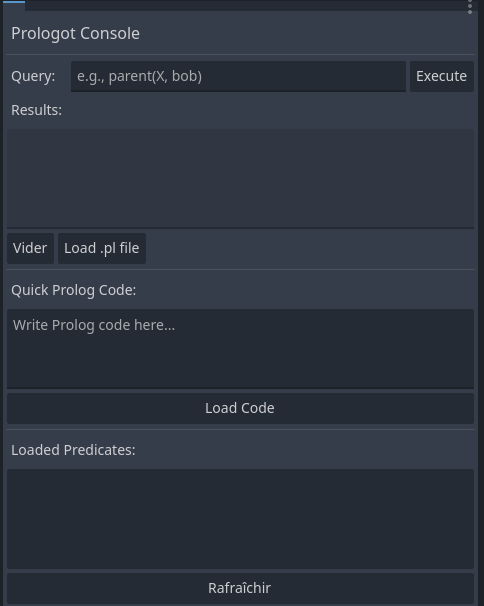

# Editor Console

The plugin adds a **Prologot Console** dock in the editor where you can:

- Execute Prolog queries interactively
- Load `.pl` files
- Write and load Prolog code snippets
- View loaded predicates



## How to Use the Dock

1. **Enable the plugin**: Go to **Project → Project Settings → Plugins** and enable "Prologot"
2. **Open the dock**: The dock should appear automatically in the bottom-right panel. If not, go to **View → Docks** and look for "Prologot Console"
3. **Initialize Prolog**: The Prolog engine is automatically initialized when the plugin loads. You should see no errors in the output
4. **Load Prolog code**:
   - Use the "Quick Prolog Code" text area to write Prolog code
   - Click "Load Code" to load it into the knowledge base
   - Or use "Load .pl file" to load an existing Prolog file
5. **Execute queries**:
   - Type a Prolog query in the "Query" field (e.g., `parent(X, bob)`)
   - Press Enter or click "Execute"
   - Results appear in the "Results" area
6. **View predicates**: Click "Refresh" to see all loaded predicates in the list

## Example Workflow

```pl
1. Type in Quick Prolog Code:
   parent(tom, bob).
   parent(bob, ann).
   grandparent(X, Z) :- parent(X, Y), parent(Y, Z).

2. Click "Load Code"

3. Type query: grandparent(X, ann)

4. Click "Execute" or press Enter

5. See results: Solution 1: {result: grandparent(tom, ann), arg1: tom, arg2: ann}
```
