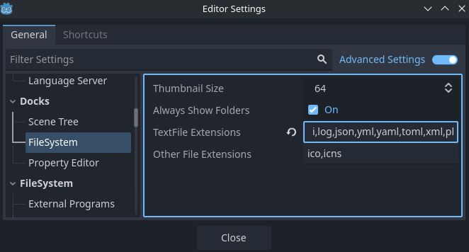

# Troubleshooting

Common issues and their solutions.

---

## "Failed to initialize Prologot"

**Problem:** The Prolog engine fails to initialize.

**Solution:**

- Prologot users do not need to install SWI-Prolog separately on their operating system.
- Make sure you have copied the `bin` folder in your Godot project. It should contain:
  - `libprologot.so` (Linux), `libprologot.dylib` (macOS), or `libprologot.dll` (Windows)
  - `libswipl.so`, `libswipl.dylib`, or `libswipl.dll` (SWI-Prolog runtime library)
  - `swipl/` folder containing SWI-Prolog resources (`boot.prc`, `library/`)
- Verify that the `prologot.gdextension` file in your project root points to the correct library path.
- If you are running Godot in headless mode (`--headless`), make sure the `.godot` folder exists in your project directory. If it does not, either launch your project once in the regular Godot editor or manually create the `.godot/extension_list.cfg` file with the following content:

```txt
res://prologot.gdextension
```

---

## Plugin Not Appearing

**Problem:** The Prologot plugin doesn't appear in the plugin list.

**Solution:**

1. Make sure `prologot.gdextension` is in your project root
2. Make sure the `bin/` folder is in your project root
3. Make sure `addons/prologot/` is in your project
4. Restart Godot
5. Check the Output panel for error messages

---

## My Prolog files are not visible in the Godot filesystem

To make your prolog files visible in Godot in `res://` you can add `pl` (or `pro` or `prolog`) to the list of text file extensions recognized by the editor, via **Editor Settings > Docks > FileSystem > TextFile Extensions**:



---

## Editor Console Not Working

**Problem:** The Prologot Console dock doesn't appear or doesn't work.

**Solution:**

1. Enable the plugin in **Project → Project Settings → Plugins**
2. Check **View → Docks** to see if the dock is available
3. Check the Output panel for initialization errors
4. Try reloading the project

---

## Variables Not Working in Queries

**Problem:** Variables in queries don't seem to work or return unexpected results.

**Solution:**

In Prolog, **variable names must start with an uppercase letter or underscore**. Lowercase names are atoms (constants), not variables. This is a fundamental Prolog rule that affects how you name things:

- ✅ **Variables** (uppercase): `X`, `Y`, `Player`, `Enemy`, `_` (anonymous)
- ❌ **Atoms** (lowercase): `x`, `y`, `tom`, `bob`, `player`

**Common mistake:**

```gdscript
# Wrong: x and y are atoms, not variables!
prolog.query_all("parent", ["x", "y"])  # Will search for atoms named "x" and "y"

# Correct: X and Y are variables
prolog.query_all("parent", ["X", "Y"])  # Will bind X and Y to actual values
```

**For character/entity names:** Use lowercase (atoms) when defining facts, but uppercase (variables) when querying:

```gdscript
# Define facts with lowercase (atoms)
prolog.add_fact("parent(tom, bob)")
prolog.add_fact("parent(bob, ann)")

# Query with uppercase (variables)
var results = prolog.query_all("parent", ["X", "Y"])
# Returns: [{"X": "tom", "Y": "bob"}, {"X": "bob", "Y": "ann"}]
```

**Note:** If you have character names that start with uppercase (like "Tom"), you'll need to quote them in Prolog: `parent('Tom', 'Bob')` or use lowercase consistently.

---

## Performance Issues

**Problem:** Queries are slow or the engine uses too much memory.

**Solution:**

1. Optimize your Prolog code
2. Use initialization options to limit resources:
```gdscript
   prolog.initialize({
       "stack limit": "512m",  # Limit stack size
       "table space": "128m",  # Limit table space
       "optimized": true       # Enable optimizations
```
3. Consider using `query_one()` instead of `query_all()` if you only need the first solution.
4. Use `retract_all()` to clean up unused facts.

---

## Failed loading

**Problem:** I have this error:

```bash
ERROR: Prologot: Invalid SWI-Prolog home directory: boot.prc not found in: foo/bar/bin/swipl. I will try to use the default one.
[FATAL ERROR: at Sun Feb  8 12:47:40 2026
        Could not find system resources]
```

**Solution:**

Prologot will try to load the

1. If you compile this project, install Swi-prolog on your operating system `make install-swi`.
2. Locate the `swipl` folder compiled and installed by default in `bin` when you compiled with `make all`.
3. If you used Godot Asset Library, ignore previous lines.
4. Pass the `swipl` folder path to the `initialize` function. For example:
```gdscript
prolog = Prologot.new()
prolog.initialize({"home": "res://bin/swipl"})
```
