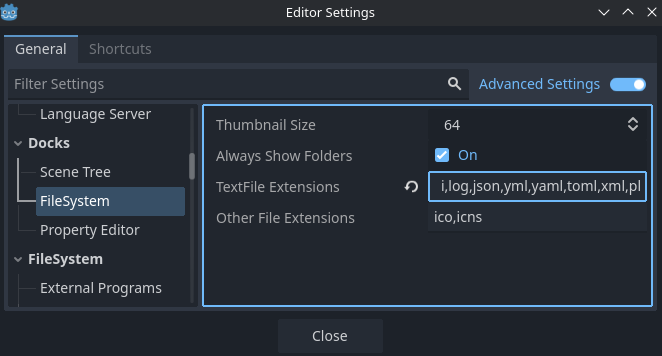

# Troubleshooting

Common issues and their solutions.

---

## "Failed to initialize Prologot"

**Problem:** The Prolog engine fails to initialize.

**Solution:**

- Prologot users do not need to install SWI-Prolog separately on their operating system.
- Make sure you have copied the `bin` folder in your Godot project. It should contain per-OS subdirectories (`linux/`, `windows/`, `macos/`), each with:
  - `libprologot.so` (Linux), `libprologot.dylib` (macOS), or `libprologot.dll` (Windows)
  - `libswipl.so`, `libswipl.dylib`, or `libswipl.dll` (SWI-Prolog runtime library)
  - `swipl/` folder containing SWI-Prolog resources (`boot.prc`, `library/`)
- Verify that `bin/prologot.gdextension` points to the correct library paths.
- If you are running Godot in headless mode (`--headless`), make sure the `.godot` folder exists in your project directory. If it does not, either launch your project once in the regular Godot editor or manually create the `.godot/extension_list.cfg` file with the following content:

```txt
res://bin/prologot.gdextension
```

---

## Plugin Not Appearing

**Problem:** The Prologot plugin doesn't appear in the plugin list.

**Solution:**

1. Make sure `bin/prologot.gdextension` exists in your project
2. Make sure the `bin/` folder is in your project root
3. Make sure `addons/prologot/` is in your project
4. Restart Godot
5. Check the Output panel for error messages

---

## My Prolog files are not visible in the Godot filesystem

To make your prolog files visible in Godot in `res://` you can add `pl` (or `pro` or `prolog`) to the list of text file extensions recognized by the editor, via **Editor Settings > Docks > FileSystem > TextFile Extensions**:



---

## Editor Console Not Working

**Problem:** The Prologot Console dock doesn't appear or doesn't work.

**Solution:**

1. Enable the plugin in **Project → Project Settings → Plugins**
2. Check **View → Docks** to see if the dock is available
3. Check the Output panel for initialization errors
4. Try reloading the project

---

## Variables Not Working in Queries

**Problem:** Queries return no solutions, or a string looks like a variable but is treated as a constant.

**Solution:**

A `String` passed to `call()` is always a Prolog **atom**. Only `prolog.variable()` creates a variable. `"X"` is the atom `X`, not a logical variable.

```gdscript
var parent = prolog.predicate("parent")

# Wrong: "X" is the atom X
prolog.solve(parent.call("tom", "X"))

# Correct: a PrologVariable object
var child = prolog.variable("Child")
for solution in prolog.solve(parent.call("tom", child)):
    print(solution.get(child))
```

Use lowercase atoms in facts (`parent(tom, bob)`). If a character name starts with an uppercase letter in a `.pl` file, quote it: `parent('Tom', 'Bob')`.

A `PrologQuery` is always truthy. Use `solve(goal).has_solution()` for a yes/no test — do not write `if prolog.solve(goal):`.

---

## Performance Issues

**Problem:** Queries are slow or the engine uses too much memory.

**Solution:**

1. Optimize your Prolog code
2. Use initialization options to limit resources:
```gdscript
   prolog.initialize({
       "stack limit": "512m",  # Limit stack size
       "table space": "128m",  # Limit table space
       "optimized": true       # Enable optimizations
```
3. Consider using `solve(goal).first()` if you only need the first solution.
4. Use `retract_all()` to clean up unused facts.

---

## Failed loading

**Problem:** I have this error:

```bash
ERROR: Prologot: Invalid SWI-Prolog home directory: boot.prc not found in: foo/bar/bin/swipl. I will try to use the default one.
[FATAL ERROR: at Sun Feb  8 12:47:40 2026
        Could not find system resources]
```

**Solution:**

Prologot will try to load the

1. If you compile this project, install Swi-prolog on your operating system `make install-swi`.
2. Locate the `swipl` folder compiled and installed by default in `bin` when you compiled with `make all`.
3. If you used Godot Asset Library, ignore previous lines.
4. Pass the `swipl` folder path to the `initialize` function. For example:
```gdscript
# Auto-detect embedded SWI-Prolog home based on OS
static func _swipl_home() -> String:
	var _os_map := {"Linux": "linux", "Windows": "windows", "macOS": "macos"}
	return "res://bin/" + _os_map.get(OS.get_name(), OS.get_name().to_lower()) + "/swipl"

prolog = Prologot.new()
prolog.initialize({"home": _swipl_home()})
```
